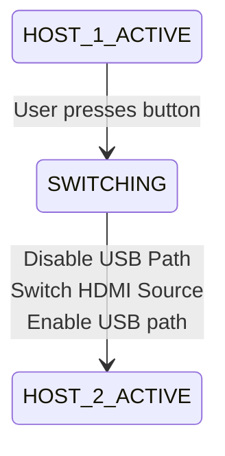
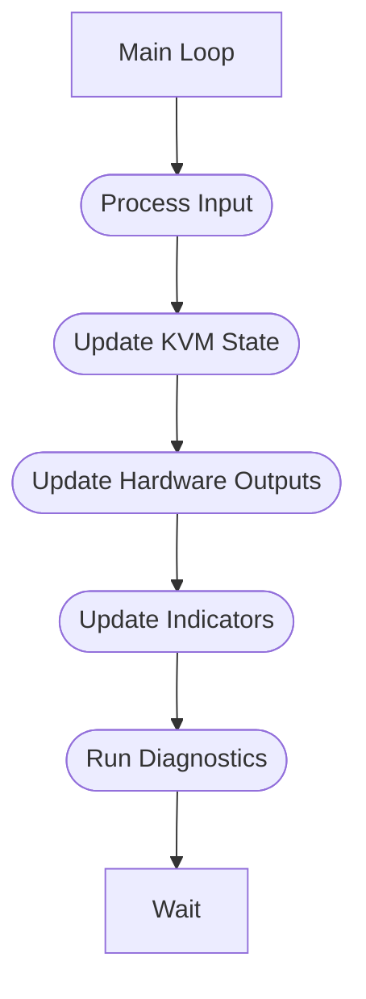
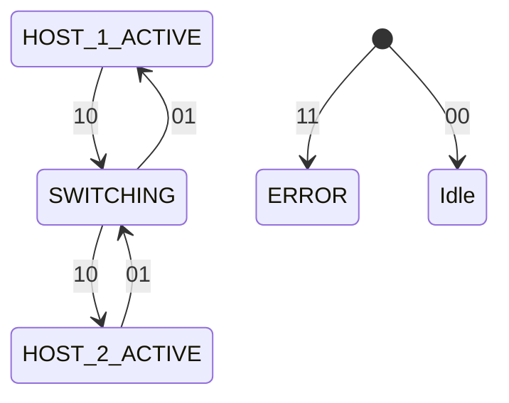

# Firmware Architecture

## Overview

The firmware controls system-level behavior of the KVM switch; including host selection, USB/HDMI switching control, user input handling, status indication, and system monitoring.

The firmware runs on a dedicated microcontroller and provides a hardware abstraction layer between user-facing functionality and the underlying switching hardware.

---

# 1. Firmware Responsibilities

The firmware shall provide the following functionality:

- Manage active host selection
- Control USB switching hardware
- Control HDMI switching hardware
- Process user input
- Manage status LEDs
- Handle startup initialization
- Provide firmware update capability

---

# 2. Firmware Architecture Overview

The firmware will have the following layers:

| Application Layer  |
| ------------------ |
| KVM State Manager  |
| User Input Manager |
| LED Manager        |

| Hardware Services  |
| ------------------ |
| USB Switch Driver  |
| HDMI Switch Driver |
| GPIO Controller    |
| Power Monitor      |

| Hardware Abstraction Layer |
| -------------------------- |
| GPIO                       |

---

# 3. Software Components

## 3.1 System Manager

### Purpose

Responsible for overall firmware operation and coordination.

Responsibilities:

- Initiliaze peripherals
- Start system services
- Maintain system state
- Maintain subsystem events

---

## 3.2 KVM State Manager

### Purpose

Control the active host state.

| Example States |
| -------------- |
| HOST_1_ACTIVE  |
| HOST_2_ACTIVE  |
| SWITCHING      |
| ERROR          |

Responsibilities:

- Track current host
- Process host change requests
- Coordinate USB and HDMI switching
- Prevent invalid transitions

Example transition:

## 3.3 USB Switch Driver

### Purpose

Provides control interface to USB switching hardware.

Responsibilities:

- Select active USB host
- Configure switch IC
- Verify switch state

Interface:

KVM State Manager
|
USB Switch Driver
|
USB Switch IC

## 3.4 HDMI Switch Driver

### Purpose

Controls HDMI signal routing.

Responsibilities:

- Select HDMI input
- Configure HDMI multiplexer
- Report switching status

---

## 3.5 User Input Manager

### Purpose

Handles user interacton.

Inputs:

- Physical button

Responsibilities:

- Debounce input
- Generate switch requests

---

## 3.6 Status LED Manager

### Purpose

Provides visual system feedback.

States:

| State         | LED Behavior    |
| ------------- | --------------- |
| Host 1 Active | LED 1 On        |
| Host 2 Active | LED 2 On        |
| Switching     | Both LEDs Flash |
| Error         | Error Pattern   |

---

# 4. Main Execution Model

The firmware uses a periodic task scheduler.

Example

# 5. Timing Requirements

| Task           | Period |
| -------------- | ------ |
| Button polling | 10 ms  |
| LED update     | 100 ms |
| State manager  | 10 ms  |
| Diagnostics    | 1 s    |

# 6. Communication Interfaces

## MCU to USB Switch

Interface:

- TBD

Purpose:

- Host selection
- Status monitoring

## MCU to HDMI Switch

Interface:

- TBD

Purpose:

- Source selection

## MCU Debug Interface

Interface:

- UART
- USB

Purpose:

- Logging
- Firmware Updates

---

# 7. Firmware State Machine

The system is controlled using a finite state machine.

States:

---

# 8. Error Handling

Firmware shall detect and handle:

- Invalid switch states
- Peripheral initialization failures
- Communication failures
- Power faults

Recovery Actions:

- Retry initialization
- Return to safe state
- Report fault condition

---

# 9. Future expansion

- Desktop control application
- Firmware update utility
- Remote switching
- USB configuration
