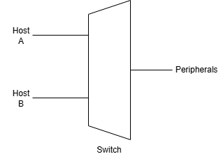

# Hardware System Architecture

## Purpose

The USB KVM will host a USB 3.0 connection and allow switching between two Hosts.

## System Goals

- USB 3.1 Gen 2 support
- 2 host computers
- 4 downstream USB ports
- Low latency switching
- External power

## High-level Block Diagram

## 

---

## Major Subsystems

### USB Switching

This is responsible for switching the USB hosts between Host A and Host B.

Components:

- USB 3.1 Gen 2 switch IC
- High-speed routing

Interfaces:

- Upstream ports
- Downstream hub

---

### USB Hub

Responsible for exposing multiple USB 3.1 Gen 2 ports.

Interfaces:

- Switch
- User ports

---

### Power Distribution

Responsible for transforming a 12 V input signal into 5V, 3.3V, and 1.2V to reduce power requirement on USB lines.

Input:

- 12 V

Outputs:

- 5 V
- 3.3 V
- 1.2 V

---

### Control MCU

Responsible for taking button input, switching the USB control, and displaying the active Host via an LED.

Responsibilities:

- Button input
- LED control
- USB switch control

Interfaces:

- GPIO

---

## Data Flow

TODO

## Design Decisions

TODO
